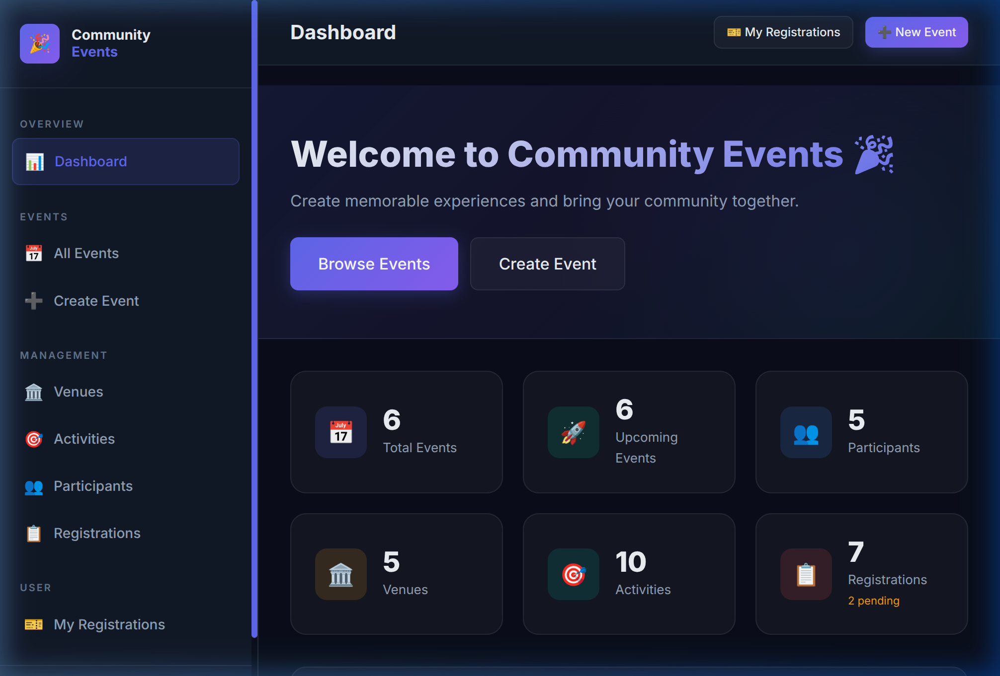
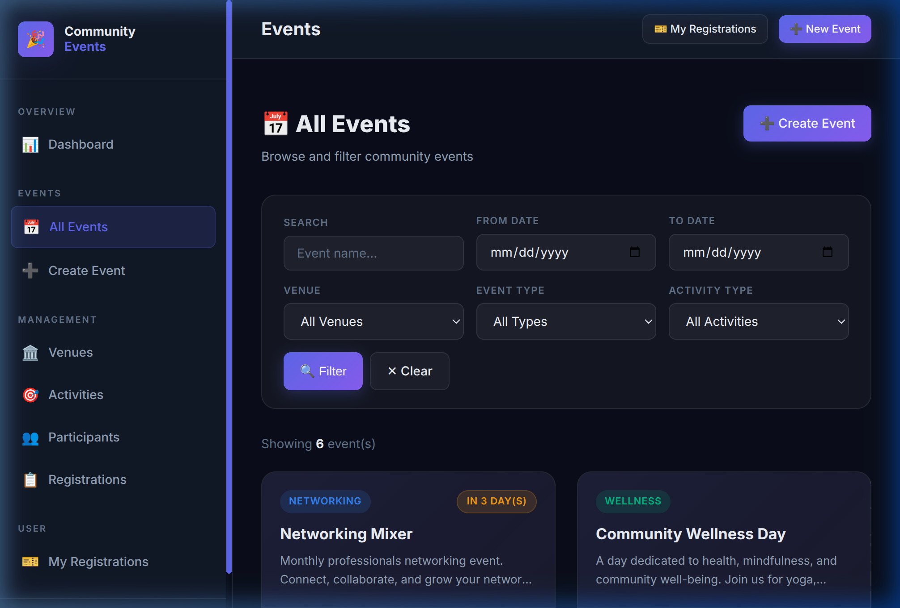
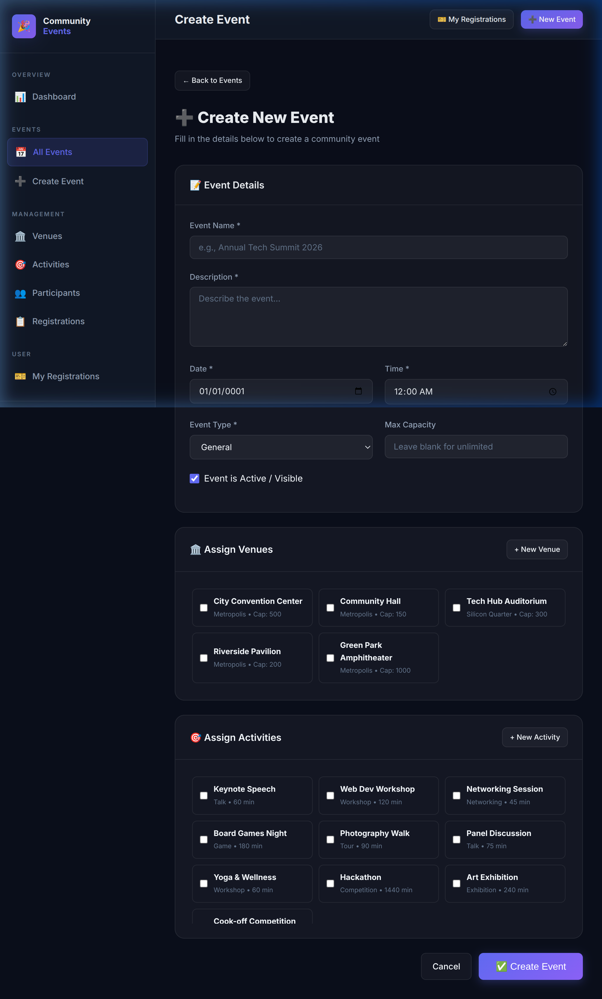
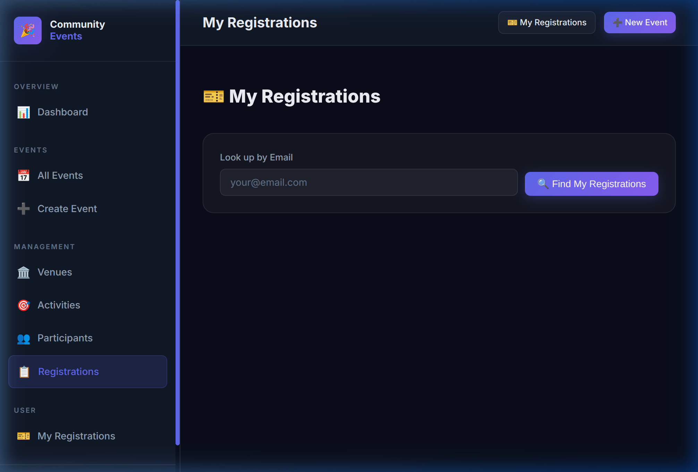

# 🎉 Community Event Management System

A full-featured web application built with **ASP.NET Core 8 MVC** and **Entity Framework Core** that allows administrators to create and manage community events, and users to browse and register for them.

---

## 📸 Screenshots

### Dashboard


### Events Listing


### Create Event


### My Registrations


---

## ✨ Features

### Admin
- ✅ Create, edit, and delete **Events** with dates, times, types, and capacity limits
- ✅ Assign multiple **Venues** and **Activities** to each event (many-to-many)
- ✅ Full CRUD management for **Venues**, **Activities**, and **Participants**
- ✅ Admin **Registrations panel** — confirm / cancel / mark attended / delete
- ✅ **Dashboard** with live stats (total events, participants, venues, registrations)

### User
- ✅ Browse upcoming events with a **filter bar** (search, date range, venue, event type, activity type)
- ✅ **Register** for events using your email address
- ✅ **My Registrations** page — lookup by email, view stats, cancel registrations
- ✅ Live **capacity tracking** with progress bars on every event card

### Technical
- ✅ EF Core migrations + **auto-seed** on startup
- ✅ Pre-loaded with **6 events, 5 venues, 10 activities, 5 participants, 7 registrations**
- ✅ Unique email constraint for participants
- ✅ Server-side model validation on all forms

---

## 🗃️ Database Schema

```
Events ──────────── EventVenues ──────────── Venues
  │                                          
  └───────────────── EventActivities ──────── Activities
  │                                          
  └───────────────── Registrations ─────────── Participants
```

| Entity | Key Fields |
|---|---|
| `Events` | Id, Name, Description, Date, Time, EventType, MaxCapacity |
| `Venues` | Id, Name, Address, City, Capacity, ContactPhone/Email |
| `Activities` | Id, Name, Type (Workshop/Talk/Game/…), DurationMinutes |
| `Participants` | Id, Name, Email (unique), Phone, Organization |
| `Registrations` | Id, ParticipantId, EventId, Status, RegisteredAt |
| `EventVenues` | EventId + VenueId (many-to-many junction) |
| `EventActivities` | EventId + ActivityId (many-to-many junction) |

---

## 🛠️ Tech Stack

| Layer | Technology |
|---|---|
| Framework | ASP.NET Core 8 MVC |
| ORM | Entity Framework Core 8 |
| Database | SQLite (file-based, zero config) |
| UI | Vanilla CSS — dark glassmorphism design system |
| Font | Inter (Google Fonts) |

---

## 📋 Prerequisites

- [.NET 8 SDK](https://dotnet.microsoft.com/download/dotnet/8.0)

Verify your installation:

```bash
dotnet --version
# Should output 8.x.x
```

---

## 🚀 Getting Started

### 1. Clone the repository

### 2. Restore dependencies

```bash
dotnet restore
```

### 3. Apply database migrations

The database is created and seeded automatically on first run. However, if you want to apply migrations manually:

```bash
# Install the EF Core CLI tool (one-time)
dotnet tool install --global dotnet-ef

# Apply migrations
dotnet ef database update
```

### 4. Run the application

```bash
dotnet run
```

The app will start and be available at:

```
http://localhost:5000
```

> On first launch, the database is **automatically seeded** with sample events, venues, activities, participants, and registrations so you can explore the app immediately.

---

## 📁 Project Structure

```
CommunityEvents/
├── Controllers/
│   ├── HomeController.cs           # Dashboard
│   ├── EventsController.cs         # Event CRUD + filtering
│   ├── VenuesController.cs         # Venue CRUD
│   ├── ActivitiesController.cs     # Activity CRUD
│   ├── ParticipantsController.cs   # Participant CRUD
│   └── RegistrationsController.cs  # Register, My Registrations, admin controls
│
├── Data/
│   ├── ApplicationDbContext.cs     # EF Core DbContext + model config
│   └── SeedData.cs                 # Sample data seeded on startup
│
├── Migrations/                     # EF Core migration files
│
├── Models/
│   ├── Event.cs
│   ├── Venue.cs
│   ├── Activity.cs
│   ├── Participant.cs
│   ├── Registration.cs
│   ├── EventVenue.cs               # Many-to-many junction
│   └── EventActivity.cs            # Many-to-many junction
│
├── ViewModels/
│   ├── DashboardViewModel.cs
│   ├── EventFilterViewModel.cs
│   └── EventViewModels.cs
│
├── Views/
│   ├── Shared/
│   │   └── _Layout.cshtml          # Sidebar + topbar layout
│   ├── Home/Index.cshtml           # Dashboard
│   ├── Events/                     # Index, Create, Edit, Details, Delete
│   ├── Venues/                     # Index, Create, Edit, Details, Delete
│   ├── Activities/                 # Index, Create, Edit, Details, Delete
│   ├── Participants/               # Index, Create, Edit, Details, Delete
│   └── Registrations/              # Index, Register, MyRegistrations
│
├── wwwroot/
│   └── css/site.css                # Full design system (dark theme)
│
├── appsettings.json                # SQLite connection string
├── Program.cs                      # App bootstrap + DI + seed
└── CommunityEvents.csproj
```

---

## 🌐 Pages & Routes

| Page | Route | Description |
|---|---|---|
| Dashboard | `/` | Stats overview + upcoming events |
| All Events | `/Events` | Filterable event listing |
| Create Event | `/Events/Create` | Admin: create new event |
| Event Details | `/Events/Details/{id}` | Full details + participants |
| Edit Event | `/Events/Edit/{id}` | Admin: update event |
| Venues | `/Venues` | View and manage venues |
| Activities | `/Activities` | View and manage activities |
| Participants | `/Participants` | View and manage participants |
| All Registrations | `/Registrations` | Admin: manage all registrations |
| Register for Event | `/Registrations/Register?eventId={id}` | User: sign up for an event |
| My Registrations | `/Registrations/MyRegistrations` | User: view/cancel registrations |

---

## 💡 Usage Guide

### Registering for an Event (as a User)

1. Go to **Participants → Add Participant** and enter your name and email.
2. Browse to **Events** and open an event's **Details** page.
3. Click **Register for Event** and enter your email address.
4. View your registrations at **My Registrations**, searchable by email.

### Managing Registrations (as Admin)

On the **Registrations** admin page you can:
- ✅ **Confirm** a pending registration
- ⛔ **Cancel** a registration
- 🎫 **Mark as Attended** after the event
- 🗑️ **Delete** a registration record

---

## ⚙️ Configuration

The SQLite database file (`communityevents.db`) is created in the project directory. The connection string is in `appsettings.json`:

```json
{
  "ConnectionStrings": {
    "DefaultConnection": "Data Source=communityevents.db"
  }
}
```

To switch to a different database provider (e.g., SQL Server), replace the `UseSqlite` call in `Program.cs` with `UseSqlServer` and update the connection string.

---

## 📦 NuGet Packages

| Package | Version |
|---|---|
| `Microsoft.EntityFrameworkCore.Sqlite` | 8.0.* |
| `Microsoft.EntityFrameworkCore.Design` | 8.0.* |
| `Microsoft.EntityFrameworkCore.Tools` | 8.0.* |

---

## 🔗 Quick Links (when running)

| Page | URL |
|---|---|
| Dashboard | http://localhost:5000 |
| All Events | http://localhost:5000/Events |
| Create Event | http://localhost:5000/Events/Create |
| Venues | http://localhost:5000/Venues |
| Activities | http://localhost:5000/Activities |
| Participants | http://localhost:5000/Participants |
| All Registrations | http://localhost:5000/Registrations |
| My Registrations | http://localhost:5000/Registrations/MyRegistrations |

---

## 📄 License

This project is open source. Feel free to use and modify it for your own community projects.
