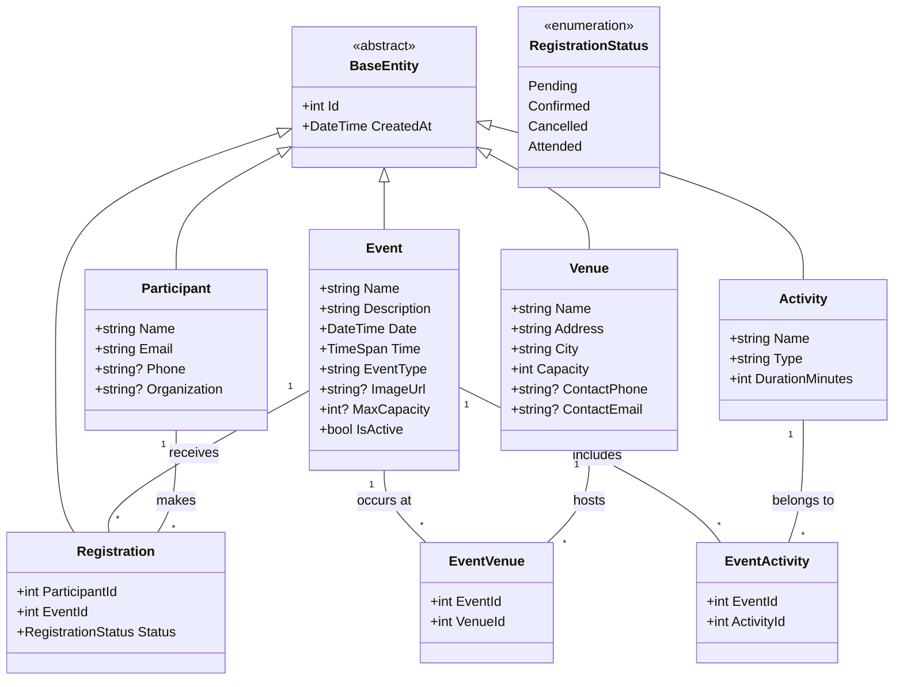

# System Class Diagram

Below is the UML Class diagram representing the core domain models of the Community Event Management system.

```mermaid
classDiagram
    class BaseEntity {
        <<abstract>>
        +int Id
        +DateTime CreatedAt
    }

    class Event {
        +string Name
        +string Description
        +DateTime Date
        +TimeSpan Time
        +string EventType
        +string? ImageUrl
        +int? MaxCapacity
        +bool IsActive
    }

    class Venue {
        +string Name
        +string Address
        +string City
        +int Capacity
        +string? ContactPhone
        +string? ContactEmail
    }

    class Activity {
        +string Name
        +string Type
        +int DurationMinutes
    }

    class Participant {
        +string Name
        +string Email
        +string? Phone
        +string? Organization
    }

    class Registration {
        +int ParticipantId
        +int EventId
        +RegistrationStatus Status
    }

    class EventVenue {
        +int EventId
        +int VenueId
    }

    class EventActivity {
        +int EventId
        +int ActivityId
    }

    class RegistrationStatus {
        <<enumeration>>
        Pending
        Confirmed
        Cancelled
        Attended
    }

    BaseEntity <|-- Event
    BaseEntity <|-- Venue
    BaseEntity <|-- Activity
    BaseEntity <|-- Participant
    BaseEntity <|-- Registration
    
    Event "1" -- "*" Registration : receives
    Participant "1" -- "*" Registration : makes

    Event "1" -- "*" EventVenue : occurs at
    Venue "1" -- "*" EventVenue : hosts

    Event "1" -- "*" EventActivity : includes
    Activity "1" -- "*" EventActivity : belongs to
```
